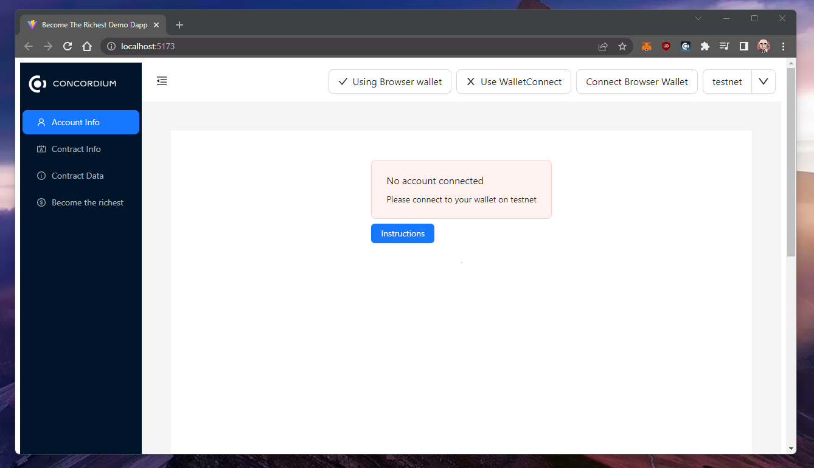
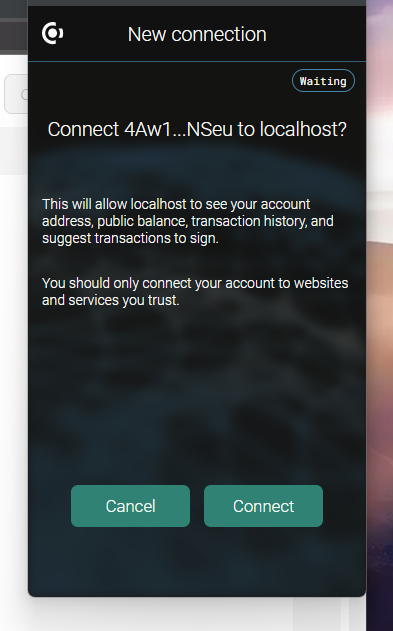
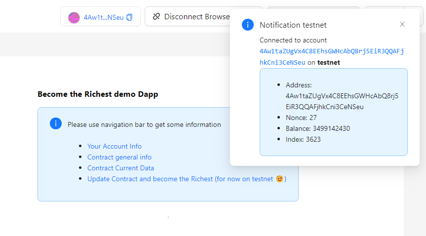
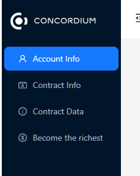
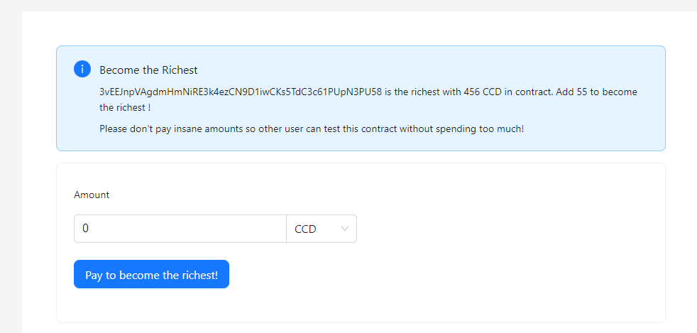
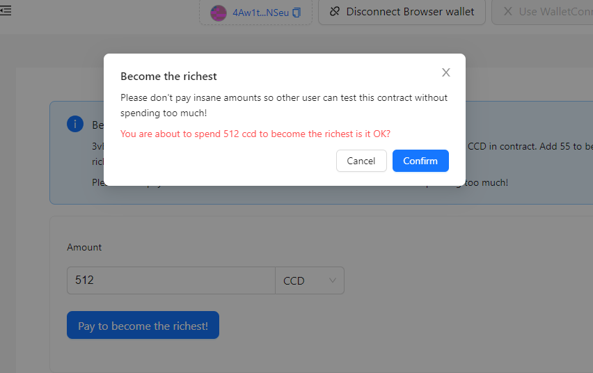
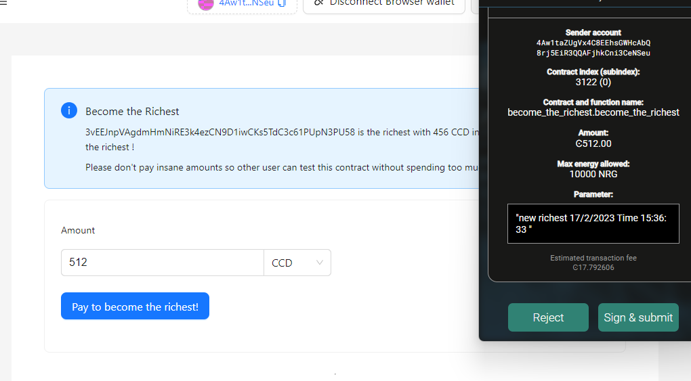
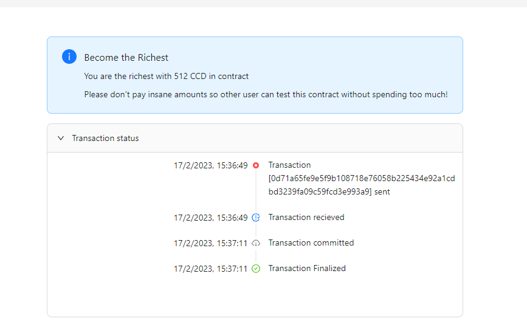

### Hackathon: Concordium Hackathon - The Future of Identity
# TASK 3: Your First Concordium DApp

# Task description

Create a web dApp that interacts with a deployed smart contract.
See [Gitcoin issue 29743](https://gitcoin.co/issue/29743)
for more details.

# Task requirements
- [x] Completion of TASK 1

[github repo for task 1](https://github.com/nabetse00/CONCORDIUM_TASK_1)

- [x] Completion of TASK 2

[github repo for task 2](https://github.com/nabetse00/CONCORDIUM_TASK_2)

# Concordium Mainnet address

`4Fo1erxUgLt7wDvaoUgxxBbV3rquCWZmnzGnDA2DUzv6FFqAKk`

# Acceptance Criteria
- [x] A brief README file with instructions on how to run the dApp + a clear description of what the dApp does and how to use it (including valid input)
- [x] your Concordium mainnet address for payout
- [] Add gif/video showing the dApp in use

Link to the [Gitcoin issue 29743](https://gitcoin.co/issue/29743)

# Submission

## Dapp description

This dApp will interact with `become_the_richest` contract developed for
[TASK 2: Deploy Your First Smart Contract](https://gitcoin.co/issue/29742).

Contract details: 
```
become_the_richest Contract:
{"index":XXXX,"subindex":0}
Contract address:
XXXX
```

See [github repo for task 2](https://github.com/nabetse00/CONCORDIUM_TASK_2)
for details about this contract.

Dapp will allow a user to:
- Checks who is the richest address 
- See the message the richest attached
- The amount the richest address sent
- The minimal increase needed to become the richest
- Send a update to the contract to become the richest

## Demo Dapp

You can access this dapp here [dapp demo github page](https://nabetse00.github.io/CONCORDIUM_TASK_3/)

You will need [concordium broswer extention](https://chrome.google.com/webstore/detail/concordium-wallet/mnnkpffndmickbiakofclnpoiajlegmg) or sign up [WalletConnect](https://walletconnect.com/).

Also you can deploy localy

## Local set up 

1. First install [concordium broswer extention](https://chrome.google.com/webstore/detail/concordium-wallet/mnnkpffndmickbiakofclnpoiajlegmg) or sign up [WalletConnect](https://walletconnect.com/).

2. Follow this [guide](https://developer.concordium.software/en/mainnet/net/guides/create-account.html#) to set up an account and add some CCD from 
testnet dispenser.

3. [OPTIONAL] for WalletConnet suport set project id variable:

Copy ./become-the-richest-dapp/.env.template to ./become-the-richest-dapp/.env and update `VITE_WALLET_CONNECT_PROJECT_ID`
variable to  
```bash
VITE_WALLET_CONNECT_PROJECT_ID={your_valid_project_id}
```
4. Execute 

```console
cd become-the-richest-dapp
npm i 
npm run dev 
```

to test dapp localy.

Server should be running at [http://localhost:5173/CONCORDIUM_TASK_3/](http://localhost:5173/CONCORDIUM_TASK_3/)
# contract code 
Contract code is in [become-the-richest-contract](./become-the-richest-contract/) folder.

# Interact with the application

First click `connect browser wallet` 



and accept the connection



Dapp shows the connected account



Get some information and interact with the contract via the navbar menu:



Click `become the richest` and send some CCD to become the richest !!!



Pay some CCD:






Wait for transaction confirmation then you should be the richest!



# video showing the dApp in use


